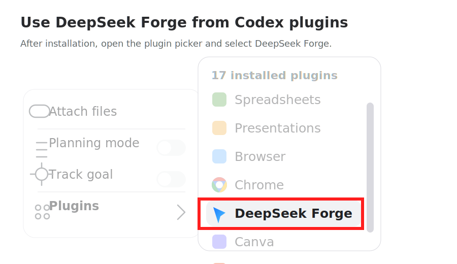

<div align="center">

# deepseek-forge

**Let Codex use DeepSeek as a safe patch generator and forward-development engine.**

Codex plans and verifies. DeepSeek returns unified diffs. You keep local control.

<strong>English</strong> · <a href="./README.zh-CN.md">简体中文</a>


</div>

## Quick Start

1. Install from the Git marketplace:

```bash
codex plugin marketplace add https://github.com/SivanCola/deepseek-forge.git --ref main
codex plugin add deepseek-forge@deepseek-forge
```

This is the recommended installation path for normal use because Codex can refresh Git marketplace snapshots.

After installation, DeepSeek Forge appears in the Codex plugin picker:



For local plugin development, clone the repository and reinstall from the local marketplace:

```bash
git clone git@github.com:SivanCola/deepseek-forge.git
cd deepseek-forge
scripts/reinstall-local-plugin.sh
```

If you use the Codex app plugin manager for development, import the cloned repository root.

2. Set your DeepSeek API key:

Write the settings to `~/.zshrc`:

```bash
echo 'export DEEPSEEK_API_KEY="your-deepseek-api-key"' >> ~/.zshrc
echo 'export DEEPSEEK_MODEL="deepseek-v4-pro"' >> ~/.zshrc
echo 'export DEEPSEEK_REASONING_EFFORT="max"' >> ~/.zshrc
echo 'export DEEPSEEK_ENABLE_1M_CONTEXT="true"' >> ~/.zshrc
source ~/.zshrc
```

Or write the same settings to `~/.profile`:

```bash
echo 'export DEEPSEEK_API_KEY="your-deepseek-api-key"' >> ~/.profile
echo 'export DEEPSEEK_MODEL="deepseek-v4-pro"' >> ~/.profile
echo 'export DEEPSEEK_REASONING_EFFORT="max"' >> ~/.profile
echo 'export DEEPSEEK_ENABLE_1M_CONTEXT="true"' >> ~/.profile
source ~/.profile
```

3. Open Codex in your target repository and ask:

```text
Use the deepseek-forge skill to implement:
<describe the feature or bug fix>
```

Codex will collect context, ask DeepSeek for a patch, validate it, review it, apply it, run checks, and request a fix patch if checks fail.

## Troubleshooting

### `spawn ... codex ENOENT`

If `codex plugin marketplace add` or `codex plugin add` fails with an error like:

```text
Error: spawn .../codex ENOENT
```

the Codex CLI native binary is missing or the global CLI install is broken. This happens before DeepSeek Forge is loaded, so it is not a plugin package error.

Reinstall the Codex CLI with optional native dependencies:

```bash
npm install -g @openai/codex@latest --force --include=optional
```

Then retry the plugin installation commands.

## Trigger Phrases

For reliable activation, mention `deepseek-forge` or `DeepSeek` explicitly:

```text
Use the deepseek-forge skill to implement:
<task>
```

Other useful phrases:

- `use deepseek`
- `delegate this to DeepSeek`
- `ask DeepSeek to generate the patch`
- `use DeepSeek to fix these failing tests`
- `ask DeepSeek to review this patch`
- `DeepSeek should generate the patch; Codex should review, apply, and test it`

## Configuration

Only `DEEPSEEK_API_KEY` is required.

| Variable | Required | Default | Purpose |
|---|---:|---|---|
| `DEEPSEEK_API_KEY` | Yes | none | DeepSeek API key. |
| `DEEPSEEK_MODEL` | No | `deepseek-v4-pro` | Model used for patch generation. |
| `DEEPSEEK_REASONING_EFFORT` | No | `max` | `high` or `max`. Compatibility values: `low` / `medium` -> `high`, `xhigh` -> `max`. |
| `DEEPSEEK_ENABLE_1M_CONTEXT` | No | `true` | Enables larger context collection. Set to `false` to reduce cost and latency. |
| `DEEPSEEK_FORGE_HOME` | No | `skills/deepseek-forge` in the installed plugin | Skill root directory of the deepseek-forge installation (where `SKILL.md` and `references/prompt_templates.md` live). |
| `DEEPSEEK_FORGE_SESSION_ID` | No | none | Optional per-conversation namespace for default artifact paths. |
| `DEEPSEEK_FORGE_ARTIFACT_DIR` | No | `/tmp/deepseek-forge/` | Base path for runtime artifacts. Thread/run subdirectories are auto-appended for isolation. Set to `.deepseek-forge` to keep artifacts in the target repo. |
| `DEEPSEEK_FORGE_LOCK_PATH` | No | `.git/deepseek-forge.lock` | Per-repository lock directory used by apply/check operations. |
| `DEEPSEEK_FORGE_DISABLE_REPO_LOCK` | No | unset | Set to `1` only when you intentionally want to bypass the repository lock. |
| `DEEPSEEK_FORGE_RUN_ID` | No | auto-generated | Override the run-id component of the artifact path. |
| `DEEPSEEK_FORGE_MAX_LOOPS` | No | `5` | Maximum forward-development loop iterations. |
| `DEEPSEEK_FORGE_MAX_PARALLEL_AGENTS` | No | `3` | Max parallel DeepSeek sub-agents per loop. |
| `DEEPSEEK_FORGE_REPO_LOCAL_ARTIFACTS` | No | `false` | When `true`, write loop artifacts to `.deepseek-forge/` in the repo. |
| `CODEX_THREAD_ID` | No | auto-detected | Set by Codex to isolate concurrent conversations. |

With 1M context enabled, context collection defaults to 200 files and 500,000 bytes. With it disabled, defaults are 80 files and 120,000 bytes.

## What Happens

For single-patch tasks (bug fixes, small features):

```text
1. Codex writes a plan.
2. Codex classifies the task (forward dev, patch, patch review, PR branch topology).
3. Codex collects repository context (full source or lightweight metadata, per mode).
4. For patch tasks, DeepSeek returns a unified diff. For topology tasks, local scripts generate a dry-run branch split plan.
5. Codex validates and reviews the output.
6. Codex applies the result safely (patch or branch commands).
7. Codex runs checks.
8. If checks fail, Codex sends sanitized logs to DeepSeek for a fix patch.
```

For forward development tasks (building features from scratch):

```text
1. DeepSeek expands the task into acceptance criteria, plan, and todos.
2. DeepSeek generates implementation patches for pending todos (parallel).
3. DeepSeek reviews each candidate patch.
4. Codex validates and applies approved patches.
5. Codex runs checks; failures are recorded in bugs.md and state.json.
6. DeepSeek generates fix patches for open bugs.
7. Codex applies fixes and re-checks.
8. DeepSeek performs final acceptance review against criteria.
9. Loop continues until all todos done or max loops reached.
```

DeepSeek never runs commands, edits files, applies patches, or commits code. It only returns text diffs and JSON reports.

## Forward Development Loop

For building features from scratch with acceptance criteria, use the
forward development loop:

```bash
python3 ${DEEPSEEK_FORGE_HOME}/scripts/dev_loop.py \
  --task task.md \
  --model deepseek-v4-pro

# Resume from a saved state
python3 ${DEEPSEEK_FORGE_HOME}/scripts/dev_loop.py \
  --task task.md \
  --resume
```

The loop generates `acceptance.md`, `plan.md`, `todo.md`, `bugs.md`, and
`state.json` in the isolated artifact directory. Codex remains the sole
executor — DeepSeek only produces diffs and JSON assessments.

### Anti-Oscillation

- Max 5 loop iterations (configurable via `DEEPSEEK_FORGE_MAX_LOOPS`).
- Same failure signature 2× stops the loop.
- Patch >8 files or >500 lines stops and requests todo splitting.

### Multi-Agent (v1)

Parallel DeepSeek API calls play different sub-roles per loop iteration:

| Sub-role | Template | Output |
|---|---|---|
| `implementer` | `implement_todo` | Unified diff |
| `reviewer` | `review_candidate_patch` | JSON review |
| `tester` | `write_tests_for_todo` | Unified diff |
| `fixer` | `fix_open_bugs` | Unified diff |

## Patch Review

Use the `deepseek.review_patch` MCP tool (or the `patch_review_task` classification) to have DeepSeek review an existing patch. The workflow is identical to the standard patch generation but uses the `review_patch` prompt template. DeepSeek returns a structured review with correctness concerns, style notes, and safety flags.

## PR Branch Topology Mode

When multiple PRs share the same head SHA (e.g., stacked or chained branches that need independent review), deepseek-forge can detect the topology and generate a safe branch split plan.

### When to Use

- Multiple PRs point at the same commit SHA on the same base ref
- You need to split a monolithic branch into independent, reviewable PR branches
- Branch surgery is required to isolate per-PR file changes

### Workflow

1. **Task classification.** The `task_classifier.py` module detects a `pr_branch_topology_task` and routes to branch surgery mode.
2. **Lightweight context.** `collect_context.py --mode pr-branch-topology` gathers only git/PR metadata (no source code), keeping the payload small.
3. **Split plan generation.** `branch_surgery.py` analyzes shared heads, computes per-PR commit ranges and file lists, and produces safe push commands.
4. **Manual review.** The generated plan is dry-run only. You review each split command before execution.
5. **Post-push verification.** A checklist confirms commits, files, head SHA, and base ref for each pushed branch.

### Safety Guarantees

- **Dry-run only.** `branch_surgery.py` never auto-executes git mutations. No commits, no pushes.
- **Force-with-lease.** Every push command uses `--force-with-lease=<remote-ref>:<expected-sha>`, ensuring the remote ref matches expectations before overwriting.
- **Manual-review fallback.** If PRs share both base and head, commit isolation is not possible; cherry-pick and push commands are commented out until a human verifies the split.
- **Shell-safe command rendering.** Generated shell commands validate PR refs, commit SHAs, PR numbers, and remotes before rendering them, using a conservative ref whitelist for branch names.
- **Fork-aware push and rollback.** Fork PRs use the resolved fork remote or SSH URL for fetch, push, and rollback instructions.
- **Human-in-the-loop.** All commands require manual execution after review.

### Manual Usage

```bash
# Detect shared heads and generate a split plan (auto-fetches PRs via gh CLI)
python3 ${DEEPSEEK_FORGE_HOME}/scripts/branch_surgery.py \
  --output .deepseek-forge/branch_surgery.md

# Or pre-collect PR data and pass it explicitly
python3 ${DEEPSEEK_FORGE_HOME}/scripts/collect_context.py \
  --mode pr-branch-topology \
  --task task.md \
  --output .deepseek-forge/repo_context.md

python3 ${DEEPSEEK_FORGE_HOME}/scripts/branch_surgery.py \
  --output .deepseek-forge/branch_surgery.md \
  --pr-list "$(gh pr list --json number,title,headRefName,baseRefName,headRefOid,baseRefOid,state,url,headRepository,headRepositoryOwner --state open --limit 50)"
```

## Files Created

Runtime files are written to an isolated artifact directory. The default path is:

```text
/tmp/deepseek-forge/{repo_hash}/{CODEX_THREAD_ID}/{run_id}/
```

This isolates artifacts across different repositories and Codex conversations.
Set `DEEPSEEK_FORGE_ARTIFACT_DIR` to override the base path.
Set `DEEPSEEK_FORGE_REPO_LOCAL_ARTIFACTS=true` to use `.deepseek-forge/` instead.

## Concurrent Use

Multiple Codex conversations can use the installed plugin at the same time. For different repositories or different git worktrees, no special setup is usually needed.

For the same repository worktree, deepseek-forge protects write-sensitive operations with a repository lock. By default the lock is `.git/deepseek-forge.lock`; outside Git it falls back to `.deepseek-forge/deepseek-forge.lock`. `apply_patch_safe.py --apply` and `run_checks.sh` acquire this lock so concurrent sessions do not apply patches or overwrite check logs at the same time.

For clearer artifact separation across conversations, set a per-session id:

```bash
export DEEPSEEK_FORGE_SESSION_ID="codex-$(date +%Y%m%d-%H%M%S)"
```

If using `.deepseek-forge/` as the artifact directory, consider adding it to `.git/info/exclude` to keep it out of version control:

```bash
echo '.deepseek-forge/' >> .git/info/exclude
```

| File | Purpose |
|---|---|
| `plan.md` | Codex implementation plan. |
| `acceptance.md` | Human-readable acceptance criteria (forward dev). |
| `todo.md` | Todo list with status (forward dev). |
| `bugs.md` | Open bugs (forward dev, written by Codex/check results). |
| `state.json` | Machine-readable loop state (forward dev). |
| `repo_context.md` | Context sent to DeepSeek. |
| `patch.diff` | Primary patch. |
| `patch_{todo_id}_{loop}.diff` | Per-todo patches (forward dev). |
| `fix.patch.diff` / `fix_{loop}.diff` | Patch generated after failed checks. |
| `check.log` / `check_{loop}.log` | Test, lint, and typecheck output. |

## Optional Manual Debugging

Most users should let Codex run the skill. For plugin development or debugging, the same steps can be run directly.

When deepseek-forge is installed as a plugin, use ``${DEEPSEEK_FORGE_HOME}`` to locate the scripts:

```bash
mkdir -p .deepseek-forge

python3 ${DEEPSEEK_FORGE_HOME}/scripts/collect_context.py \
  --task task.md \
  --output .deepseek-forge/repo_context.md

python3 ${DEEPSEEK_FORGE_HOME}/scripts/deepseek_worker.py \
  --model deepseek-v4-pro \
  --task task.md \
  --context .deepseek-forge/repo_context.md \
  --output .deepseek-forge/patch.diff

python3 ${DEEPSEEK_FORGE_HOME}/scripts/apply_patch_safe.py --patch .deepseek-forge/patch.diff --check
python3 ${DEEPSEEK_FORGE_HOME}/scripts/apply_patch_safe.py --patch .deepseek-forge/patch.diff --apply
bash ${DEEPSEEK_FORGE_HOME}/scripts/run_checks.sh
```

For repo-internal debugging (e.g., when hacking on deepseek-forge itself), use the plugin package script path:

```bash
mkdir -p .deepseek-forge

python3 plugins/deepseek-forge/skills/deepseek-forge/scripts/collect_context.py \
  --task task.md \
  --output .deepseek-forge/repo_context.md

python3 plugins/deepseek-forge/skills/deepseek-forge/scripts/deepseek_worker.py \
  --model deepseek-v4-pro \
  --task task.md \
  --context .deepseek-forge/repo_context.md \
  --output .deepseek-forge/patch.diff

python3 plugins/deepseek-forge/skills/deepseek-forge/scripts/apply_patch_safe.py --patch .deepseek-forge/patch.diff --check
python3 plugins/deepseek-forge/skills/deepseek-forge/scripts/apply_patch_safe.py --patch .deepseek-forge/patch.diff --apply
bash plugins/deepseek-forge/skills/deepseek-forge/scripts/run_checks.sh
```

Advanced debugging environment variables:

| Variable | Purpose |
|---|---|
| `DEEPSEEK_TEMPLATE_PATH` | Override prompt template auto-detection. |
| `CHECK_COMMANDS` | Override `run_checks.sh` with explicit commands. |

## MCP Tools

The plugin includes a `deepseek-forge-mcp` server with these tools:

| Tool | Purpose |
|---|---|
| `deepseek.plan` | Create an implementation plan. |
| `deepseek.implement` | Generate a patch. |
| `deepseek.fix_tests` | Generate a fix patch from failure logs. |
| `deepseek.review_patch` | Review a patch. |
| `deepseek.explain_patch` | Explain a patch. |
| `deepseek.expand_plan` | Expand a task into acceptance criteria, plan, and todos. |
| `deepseek.implement_todo` | Generate a patch for a specific todo item. |
| `deepseek.review_candidate_patch` | Review a candidate implementation patch. |
| `deepseek.write_tests_for_todo` | Write tests for a todo item. |
| `deepseek.fix_open_bugs` | Generate a fix patch for open bugs. |
| `deepseek.final_acceptance_review` | Final assessment against acceptance criteria. |

## Verify This Repository

```bash
python3 -m unittest discover -s tests -v
scripts/check-plugin-package.sh --clean
```

To reinstall the local plugin after changing package files:

```bash
scripts/reinstall-local-plugin.sh
```

For a smoke test that does not touch your real Codex configuration:

```bash
tmp_home="$(mktemp -d)"
CODEX_HOME="$tmp_home" scripts/reinstall-local-plugin.sh
rm -rf "$tmp_home"
```

Current local result: `403 tests, 0 failures`.

## License

This project is licensed under the MIT License. See [LICENSE](./LICENSE) for
the full license text.
